# Production performance review

This document records a production-oriented performance review of ContentForge: findings, fixes applied in this pass, deferred work, and verification results.

Related docs:

- [Query performance and safety](./query-performance.md) — pagination, sort whitelists, search safety, indexes, admin search N+1 fix, public caching
- [Database review](./database-review.md)
- [REST API review](./api-review.md)
- [ARCHITECTURE.md](../ARCHITECTURE.md)

---

## Executive summary

ContentForge already had strong foundations for bounded queries (pagination caps, sort whitelists, parameterized search, batch ID loading for admin search). This review focused on **concrete production risks**: oversized payloads, redundant database work, stale cache keys, duplicate frontend requests, and sync-over-async I/O.

**Fixes applied:** 14 backend/frontend changes (see [Fixes applied](#fixes-applied)). All CI verification commands pass (see [Verification](#verification)).

**Remaining gaps** are documented as deferred items; none block current single-instance deployment at expected scale.

---

## Review scope

| Area | What was inspected |
|------|-------------------|
| Database queries | EF repositories, search service, bulk delete, public vs admin list paths |
| Indexes | Content entry list/search indexes (migration `AddContentEntryQueryIndexes`) |
| API serialization | Content-type list, public content, admin list DTO shapes |
| Pagination | Normalized page size, public list cache keys |
| Dynamic JSON | Draft/published snapshot deserialization on list vs detail paths |
| Media operations | Upload stream reads, library detail fetches |
| Caching | Public content memory cache, invalidation on lifecycle events |
| Frontend rendering | List views, relation/media field inputs, audit/media detail panels |
| Network requests | Duplicate fetches on pagination, per-field relation/media calls |
| Async I/O | Repository and gateway async patterns |
| Cancellation | `CancellationToken` propagation through handlers and repositories |

---

## Findings and disposition

### Database queries and N+1

| Finding | Severity | Disposition |
|---------|----------|-------------|
| Admin content search loaded full entries (with versions) per hit | High | **Fixed** — batch `GetSummariesByIdsAsync` (documented in [query-performance.md](./query-performance.md)) |
| Public slug lookup used `Include(Versions)` | Medium | **Fixed** — `GetPublishedBySlugAsync` uses indexed slug lookup + `ToDomainPublicSummary` without version graph |
| Public lists deserialized `DraftDataJson` for every row | Medium | **Fixed** — `PublishedRepresentationOnly` lists map via `ToDomainPublicSummary` (`ContentData.Empty`, published snapshot only) |
| Content-type list eagerly loaded all field definitions | Medium | **Fixed** — list returns `ContentTypeListItem` with batched field-count query; full fields only on get-by-id |
| Bulk delete loaded all entries into memory | Medium | **Fixed** — `DeleteAllByContentTypeIdAsync` uses `ExecuteDeleteAsync` |
| Published slug resolved via JSON `Contains` fallback | Low | **Accepted** — fallback only when indexed draft slug miss; deferred: dedicated `PublishedSlug` column + index |

### Indexes

Existing and added indexes support admin lists, public lists, and sort/filter columns. See [query-performance.md](./query-performance.md#indexes-contententries).

**Not indexed:** `DraftDataJson` text search (ILIKE contains). Acceptable at current scale; full-text search deferred.

### API serialization and oversized responses

| Finding | Severity | Disposition |
|---------|----------|-------------|
| Content-type list returned full field schemas | Medium | **Fixed** — `ContentTypeDto.FieldCount` on list; `Fields` empty until detail endpoint |
| Admin content list still returns full `ContentEntryDto` with draft JSON | Medium | **Deferred** — introduce `ContentEntrySummaryDto` for list/search endpoints |
| Public API returns only `PublicContentDto` | — | **OK** — no draft leakage |

### Pagination

Pagination normalization (`MaxPageSize` 100) is enforced application-side and in `ToPaginatedResultAsync`. Public list cache keys include normalized pagination + filter parameters.

No unbounded collection endpoints were found.

### Dynamic JSON processing

| Path | Behavior after review |
|------|----------------------|
| Public list/detail | Deserializes published snapshot only |
| Admin list | Still deserializes draft JSON per row — deferred summary DTO |
| Admin detail / edit | Full draft + version history — appropriate for those endpoints |

### Media operations

| Finding | Severity | Disposition |
|---------|----------|-------------|
| Azure upload `LimitedReadStream.Read` used sync-over-async | Medium | **Fixed** — synchronous `Read` throws `NotSupportedException`; async path only |
| Media library detail re-fetched asset after list load | Low | **Fixed** — detail panel uses list row; `primeMediaAssetCache` on select |
| Media field inputs fetched same asset repeatedly | Low | **Fixed** — `useMediaAssetCache` deduplicates `getMedia` by id |

### Caching

Public content cache (`MemoryPublicContentCache`) stores only `PublicContentDto` after visibility checks.

| Finding | Severity | Disposition |
|---------|----------|-------------|
| Entry invalidation missed published slug when draft slug differed | High | **Fixed** — `InvalidateEntryAsync` accepts optional `publishedSlug`; helper `PublicContentCacheInvalidation` |
| List cache could serve stale entries after content-type deactivation | Medium | **Fixed** — entry keys include content-type version stamp; type invalidation bumps version |
| Invalidation missing on entry update/delete, type slug change, scheduled jobs | Medium | **Fixed** — wired through lifecycle commands, entry commands, type commands, `ScheduledJobProcessor` |
| Single-instance memory cache only | Low | **Deferred** — distributed cache (Redis) for horizontal scale |

See [query-performance.md — Public content caching](./query-performance.md#public-content-caching) for TTL and configuration.

### Frontend rendering and network requests

| Finding | Severity | Disposition |
|---------|----------|-------------|
| Content entry list double-fetch on page-size change | Medium | **Fixed** — separate `watch(page)` and `watch(pageSize)`; page reset without duplicate load |
| Content type resolved on every entry page fetch | Low | **Fixed** — content type loaded once per slug route |
| Relation fields each called `listContentEntries` independently | Medium | **Fixed** — `useRelationOptions` caches by `contentTypeId` |
| Audit log detail called `getAuditLog` after list | Low | **Fixed** — detail panel uses selected list row |
| Global loading overlay / request dedup in API client | Low | **Deferred** — optional UX polish |

### Async I/O and cancellation

- Repositories and handlers consistently accept and pass `CancellationToken`.
- No remaining `GetAwaiter().GetResult()`, `.Result`, or `.Wait()` in production code paths.
- EF operations use async APIs (`ToListAsync`, `ExecuteDeleteAsync`, etc.).

---

## Fixes applied

### Backend

1. **`ToDomainPublicSummary`** — maps list/public rows without deserializing draft JSON or loading versions (`DomainMappers.cs`).
2. **`GetPublishedBySlugAsync`** — slim query path for public slug resolution (`EfContentEntryRepository.cs`).
3. **`PublishedRepresentationOnly` list mapping** — uses public summary mapper in `ListAsync`.
4. **`ExecuteDeleteAsync`** for bulk delete by content type (`DeleteAllByContentTypeIdAsync`).
5. **`ContentTypeListItem` + field count** — list endpoint avoids loading field definitions (`EfContentTypeRepository`, `ContentTypeMapper.ToListDto`).
6. **`PublicContentCacheInvalidation` helper** — centralizes entry invalidation with draft + published slug (`PublicContentCacheInvalidation.cs`).
7. **Cache key versioning** — content-type version in entry cache keys; list/type invalidation bumps versions (`MemoryPublicContentCache.cs`, `PublicContentCacheInvalidator.cs`).
8. **Lifecycle invalidation expanded** — publish, unpublish, archive, update, delete, content-type changes, scheduled jobs.
9. **Azure upload stream** — disallow synchronous read on `LimitedReadStream` (`AzureBlobStorageGateway.cs`).

### Frontend

1. **`ContentEntryListView.vue`** — deduplicated pagination watchers; separate content-type resolution.
2. **`useRelationOptions.ts`** — shared in-flight cache for relation dropdown options.
3. **`useMediaAssetCache.ts`** — deduplicated media fetches; priming from list selection.
4. **`AuditLogView.vue`** — detail from list row (no redundant GET).
5. **`MediaLibraryBrowser.vue`** — detail from list row; `primeMediaAssetCache` on select.
6. **Content type list UI** — displays `fieldCount ?? fields.length` for list vs detail shapes.

### Tests updated

- `auditLogView.test.ts` — expects no `getAuditLog` call when selecting a row.
- Backend tests adjusted for `ContentTypeListItem` and cache invalidator dependencies.

---

## Deferred recommendations

Prioritized follow-ups when scale or traffic requires them:

1. **`ContentEntrySummaryDto`** for admin list and search — reduce payload size and JSON deserialization on list views.
2. **PostgreSQL full-text search** — replace `DraftDataJson ILIKE` for keyword search.
3. **`PublishedSlug` persisted column** — indexed lookup instead of JSON contains fallback.
4. **Distributed public cache** — Redis or CDN edge cache for multi-instance API.
5. **Response compression** — enable Brotli/gzip at reverse proxy or ASP.NET middleware.
6. **Version history lazy loading** — summary endpoint for entry list; load versions on demand.
7. **API client request coalescing** — dedupe concurrent identical GETs globally.

---

## Verification

All commands from `AGENTS.md` were run after fixes:

| Command | Result |
|---------|--------|
| `dotnet build` | Pass (0 warnings, 0 errors) |
| `dotnet test` | Pass — 162 unit, 26 architecture, 235 integration |
| `dotnet format --verify-no-changes` | Pass |
| `npm run lint` | Pass |
| `npm run test` | Pass — 83 tests |
| `npm run build:vite` | Pass |

Integration coverage for query performance and public cache remains in:

- `tests/ContentForge.IntegrationTests/Persistence/QueryPerformancePersistenceTests.cs`
- `tests/ContentForge.IntegrationTests/Api/PublicContentCacheIntegrationTests.cs`

---

## Architecture diagram (read paths)

```mermaid
flowchart TB
    subgraph AdminList["Admin content list / search"]
        A1[API handler] --> A2[EF query paginated]
        A2 --> A3[Map rows to DTO]
        A3 --> A4[JSON response]
    end

    subgraph PublicRead["Public content read"]
        P1[API handler] --> P2{Cache hit?}
        P2 -->|yes| P3[PublicContentDto]
        P2 -->|no| P4[EF published-only query]
        P4 --> P5[ToDomainPublicSummary]
        P5 --> P6[Map + cache set]
        P6 --> P3
    end

    subgraph Invalidate["Write / lifecycle"]
        W1[Publish / unpublish / delete] --> W2[PublicContentCacheInvalidation]
        W2 --> W3[Bump type version + remove entry keys]
    end
```

---

## Change log

| Date | Author | Notes |
|------|--------|-------|
| 2026-08-31 | Performance review pass | Initial document; fixes listed above |
