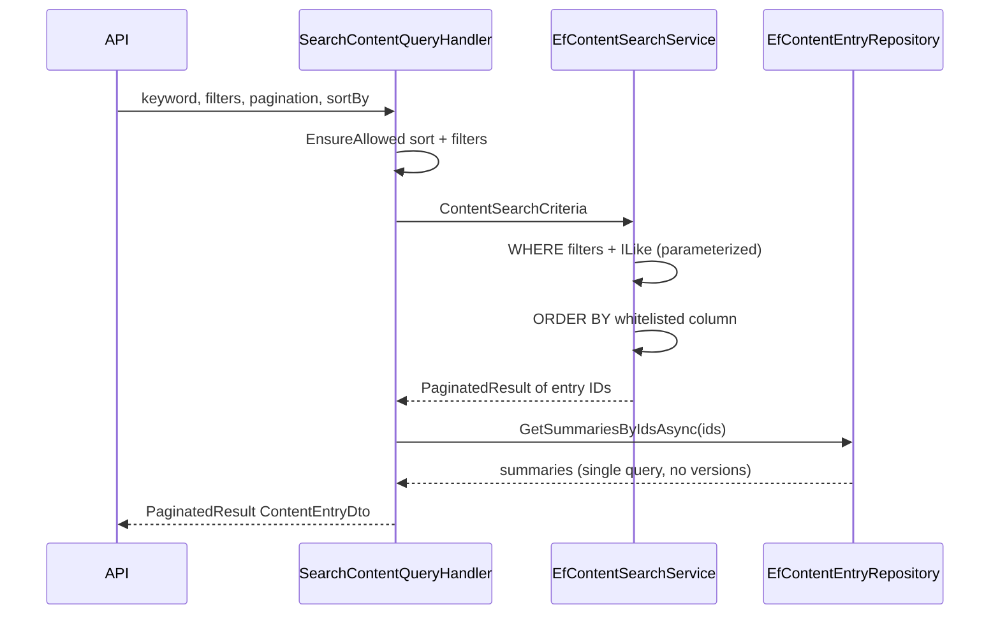

# Query performance and safety

This document records how ContentForge keeps list, search, filter, sort, and pagination operations **server-side**, **bounded**, and **safe from client-driven SQL injection**.

Primary references: [ARCHITECTURE.md](../ARCHITECTURE.md), [api-review.md](./api-review.md), [database-review.md](./database-review.md).

---

## Design principles

| Concern | Approach |
|---------|----------|
| Pagination | All collection endpoints use `PaginationRequest`; infrastructure applies `NormalizedPage`, `NormalizedPageSize`, and `Skip` via `QueryExtensions.ToPaginatedResultAsync`. |
| Page size cap | `PaginationDefaults.MaxPageSize` (100) is enforced in the application layer before `Skip`/`Take`. |
| Sorting | `SortRequest.EnsureAllowed(...)` in handlers; repositories map allowed field names to fixed `OrderBy`/`OrderByDescending` expressions (switch-based, never raw strings). |
| Filtering | Explicit criteria records per query; unknown query keys rejected at the API via `QueryBinding.EnsureAllowedQueryParameters`. |
| Search | `PortableSearch.CreateContainsPattern` escapes `%`, `_`, and `\` before building `LIKE`/`ILIKE` patterns; EF passes values as parameters. |
| N+1 avoidance | List queries project summaries without `Include(Versions)`; admin search batch-loads hits via `GetSummariesByIdsAsync` (single `IN` query). |

---

## Pagination normalization

`PaginationRequest` clamps invalid input:

- `page < 1` → `1`
- `pageSize < 1` → `1`
- `pageSize > 100` → `100`

**Important:** Repositories and search services must use `NormalizedPage` / `NormalizedPageSize` (or `ToPaginatedResultAsync`), not raw `Page` / `PageSize`, so the response envelope reflects clamped values and `Take` never exceeds the cap.

---

## Sort field whitelists

Each list/search handler validates sort fields before calling persistence:

| Resource | Allowed sort fields |
|----------|----------------------|
| Content entries | `slug`, `status`, `createdAt`, `updatedAt`, `publishedAt` |
| Content search | `createdAt`, `updatedAt`, `publishedAt`, `slug` |
| Public content | `slug`, `publishedAt` |
| Content types | `name`, `createdAt`, `updatedAt` |
| Media | `fileName`, `createdAt`, `updatedAt` |
| Users | `email`, `displayName`, `createdAt` |
| Audit logs | `timestamp`, `action`, `entityType` |

Unsupported `sortBy` values return HTTP 400 from the application layer.

---

## Search pattern safety

User keywords are not concatenated into SQL as order expressions or column names. For text search:

1. Trim whitespace.
2. Escape `\`, `%`, and `_` for LIKE semantics.
3. Wrap with `%` for contains matching.
4. Pass the escape character (`\`) to `EF.Functions.ILike` / `Like` (PostgreSQL and SQL Server).

This prevents a search for `100%` from matching every slug containing `100`.

---

## Indexes (ContentEntries)

Supporting common admin and public list patterns:

| Index | Purpose |
|-------|---------|
| `(ContentTypeId, IsDeleted, UpdatedAt)` | Admin lists filtered by type, excluding deleted, sorted by recency |
| `(ContentTypeId, IsDeleted, PublishedAt)` | Public lists of published entries by type, sorted/filtered by publish date |
| `PublishedAt` | Range filters and sort on publish timestamp |
| Existing single-column indexes | `Status`, `Slug`, `CreatedAt`, `UpdatedAt`, `CreatedBy`, scheduling columns |

Migration: `AddContentEntryQueryIndexes`.

Full-table scans on `DraftDataJson` for keyword search remain acceptable at current scale; moving to PostgreSQL full-text search would be a separate change behind `IContentSearchService`.

---

## Admin content search flow

Previously, the handler issued one `GetByIdAsync` (with versions) per hit — an N+1 pattern removed by batch summary loading.

---

## Public content lists

Public queries set `PublishedRepresentationOnly: true` on `ContentEntryListCriteria`, which filters at the database:

- `PublishedSnapshotJson IS NOT NULL`
- `PublishedAt IS NOT NULL`
- `IsDeleted = false`

Post-query in-memory visibility filtering was removed to keep page counts aligned with the database result set.

---

## Verification

Integration tests in:

- `tests/ContentForge.IntegrationTests/Persistence/QueryPerformancePersistenceTests.cs` — clamping, LIKE escaping, parameterized SQL shape, batch ID load
- `tests/ContentForge.IntegrationTests/Api/ApiInfrastructureIntegrationTests.cs` — API envelope reflects clamped page size

---

## Public content caching

Published public reads (`GET /api/v1/public/...`) may be cached via `IPublicContentCache` (Infrastructure: `MemoryPublicContentCache`).

| Setting | Default | Purpose |
|---------|---------|---------|
| `PublicContentCache:Enabled` | `true` | Master switch |
| `EntryTtlSeconds` | `300` | TTL for single-entry cache |
| `ListTtlSeconds` | `60` | TTL for paginated list cache |
| `MaxEntries` | `1024` | `IMemoryCache` size limit |

**Safety:** Only `PublicContentDto` payloads are cached, and only after `PublicContentVisibility.IsPubliclyVisible` succeeds. Drafts and admin DTOs are never cached.

**Invalidation:** `IPublicContentCacheInvalidator` runs after publish, unpublish, archive, delete, content-type deactivation, and scheduled publish/unpublish jobs.

List cache keys include a per-content-type version stamp; entry keys are removed explicitly on invalidation.

See integration tests in `PublicContentCacheIntegrationTests.cs`.
